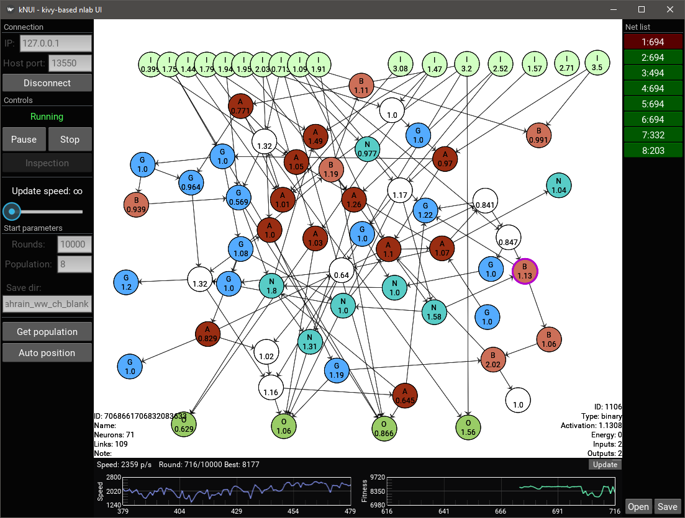

# kNUI - kivy-based nlab user interface

kNUI is a GUI for nlab, written in python and based on kivy framework.

kNUI can connect to nlab server via UDP and control it.
Also you can view and edit nlab's `.nnt` networks.

Works on Windows, Linux, OS X, basically anywhere where you can install
[kivy](https://kivy.org/#download), but kNUI is designed to use on desktop platforms.

- Copyright (c) 2016 Leonid Shekhtman, Kirill Dudkin
- License: MIT License

## Requirements

* python 3.x (tested on 3.5)
* [kivy](https://kivy.org/#download) (>=1.9)
* [tinyrpc](https://github.com/mbr/tinyrpc) (>=0.6.dev0)

## Installation

You can install kNUI using pip:
```bash
> pip install https://github.com/apostol3/knui/archive/master.zip
```
This command will install kNUI launch script.
Then you can launch kNUI in console:
```bash
> kNUI
```

If you don't want install package in your system or you want to make some changes
you can [download](https://github.com/apostol3/knui/archive/master.zip)
this repository and unpack it. Then open terminal, move to unpacked directory and
just launch it:
```bash
> python -m kNUI.main
```

## Usage

1. Connecting to a server
   * Specify ip and port of launched nlab server. (default nlab port is `13550`)
   * Press `Connect` button.
2. Launching nets training
   * Specify training parameters, such as:
       * rounds,
       * population size,
       * directory for saving networks on server (`./nets/*directory*`).
   * Press `Start` button.
3. Controlling server:
   * `Pause`, `Resume`, `Stop` buttons.
   * Get networks from server.
   * Inspection mode. When inspection mode is on, server changes its speed to 60 p/s.
     It may be a little laggy, but we're working on it!
4. Editing networks
   * Open a network from `.nnt` file.
   * Edit it (you can add or edit neurons, links)
   * Save network to `.nnt` file.

## Screenshot



## Uninstalling
Open terminal and use pip to uninstall module:
```bash
> pip uninstall kNUI
```

## Authors

- [Leonid Shekhtman](https://github.com/leonljsh) (leon.ljsh@gmail.com)
- [Kirill Dudkin](https://github.com/apostol3) (apostol3.mv@yandex.ru)